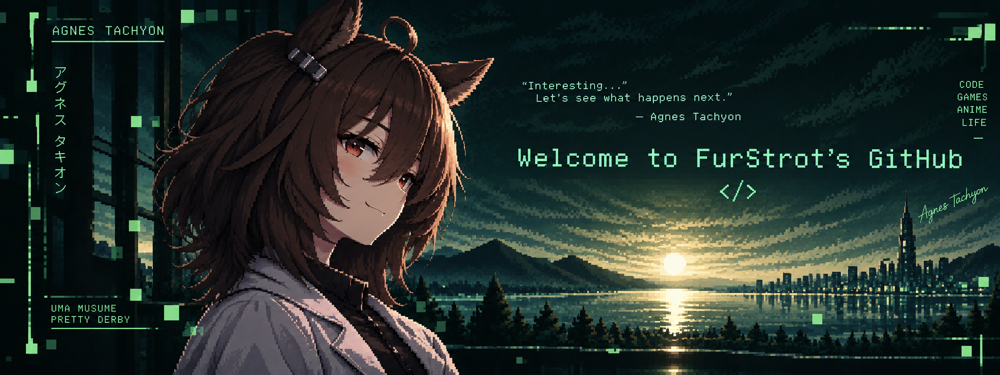

###  *Technologies*

---

##  *About me*

Hello! **FurStrot**, a software engineer passionate about technology, games, and Uma Musume. I enjoy building useful projects, exploring new tools and ideas, and learning something new every day.

Currently, I'm focused on developing my skills in programming, web development, and game design. In my free time I love racing, anime, and of course - **Agnes Tachyon**.

 

###  *Languages*

---

  

  

    <strong>Python</strong> — my main language,
    with 2 years of experience. Mostly focused on automation, bots and useful tools.
  

  

    <strong>QML</strong> — used for building
    interfaces and applications with a focus on clean and interactive UI.
  

  

    <strong>JavaScript</strong> — used for
    web development and adding interactivity to websites.
  

  

    <strong>HTML / CSS</strong> — building
    and styling websites and user interfaces.
  

   

###  *Hobbies & Goals*

---

<em>"The world is full of interesting things." Agnes Tachyon</em>

<table border="0" cellpadding="0" cellspacing="0" width="100%">
<tr>
<td valign="middle" width="70%">

<table>
<tr>
<td align="center" width="90">
 
Programming
</td>
<td align="center" width="90">
 
Gaming
</td>
<td align="center" width="90">
 
Learning
</td>
<td align="center" width="90">
 
Uma Musume
</td>
<td align="center" width="90">
 
Tea
</td>
</tr>
</table>

</td>
<td valign="middle" align="center" width="30%">

</td>
</tr>
</table>

